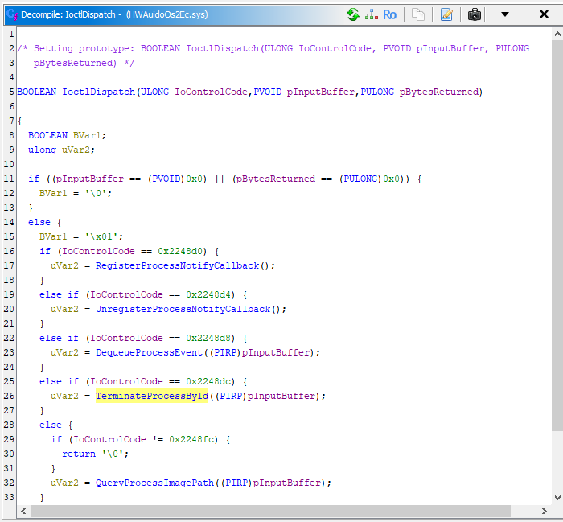
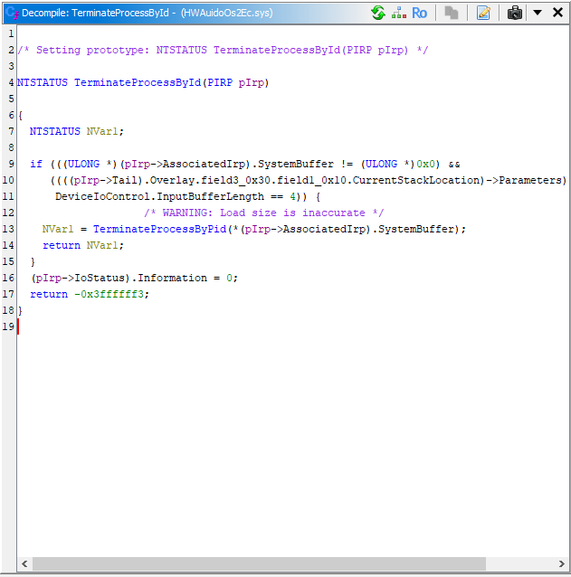
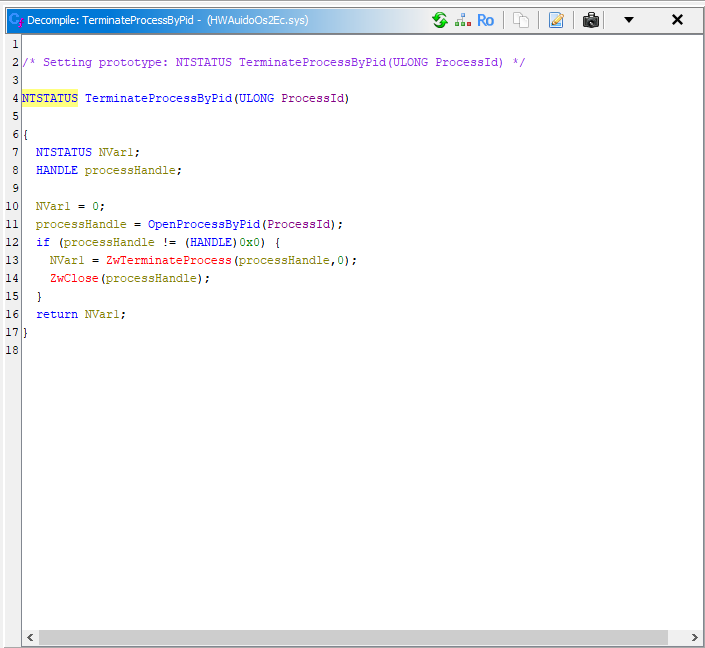
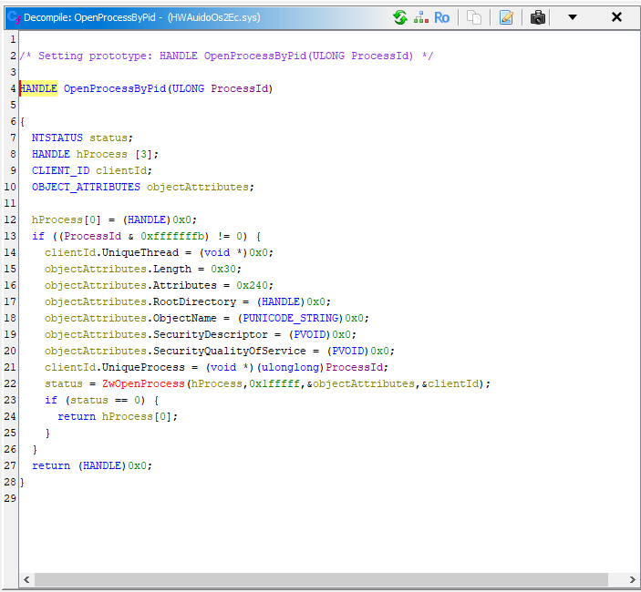

# BYOVD — HwAudKiller Process Terminator

A proof-of-concept BYOVD (Bring Your Own Vulnerable Driver) tool that exploits the signed but vulnerable Huawei audio driver `HWAudioOs2Ec.sys` to terminate arbitrary processes from kernel mode, bypassing userland process protections such as those used by EDR/AV software.

## Usage

First, load the vulnerable driver:

```powershell
sc create hwaud type=kernel binPath=C:\path\to\HWAudioOs2Ec.sys
sc start hwaud
```

Then run the tool with the target process name:

```powershell
.\HwAudKiller.exe notepad.exe
```

## How It Works

1. **Load the vulnerable driver** — registers and starts `HWAudioOs2Ec.sys` as a kernel service via the Service Control Manager
2. **Resolve target PID** — walks the process list via `CreateToolhelp32Snapshot` to find the PID of the named process
3. **Send kill IOCTL** — sends IOCTL `0x2248DC` to `\\.\HWAudioX64` with the target PID; the driver's IOCTL dispatch routes it to `TerminateProcessById`

   

4. **`TerminateProcessById`** — calls `TerminateProcessByPid` to do the actual termination in kernel mode, bypassing any userland hooks on `NtTerminateProcess` or handle guards used by EDR/AV software

   

5. **`TerminateProcessByPid`** — opens a kernel handle to the process via `OpenProcessByPid`, then terminates it

   

6. **`OpenProcessByPid`** — opens a kernel handle to the target process by PID

   

## Requirements

- Administrator privileges (required to create kernel services)
- `HWAudioOs2Ec.sys` — the vulnerable Huawei audio driver

## References

- [HwAudKiller: BYOVD EDR Bypass via Vulnerable Huawei Driver](https://labs.cloudsecurityalliance.org/research/csa-research-note-hwaudkiller-byovd-edr-bypass-malvertising/)
